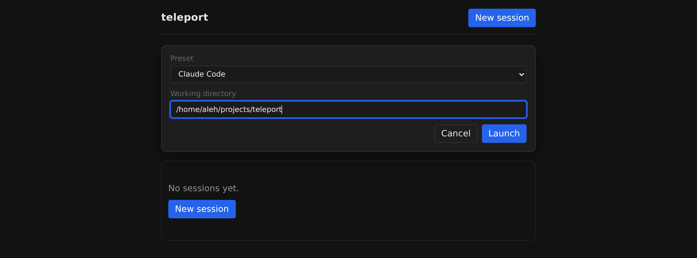
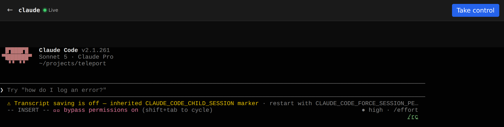
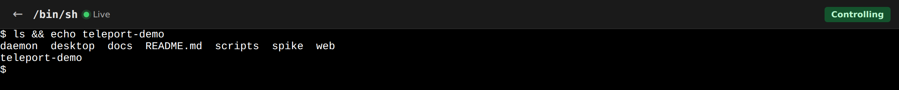

# teleport

A local, headless terminal/session daemon with disposable clients. `teleportd` owns
every PTY and child process (shell, Codex, Claude, whatever); your browser, phone, or
desktop shell just attach and detach. Closing a tab never kills the agent running
inside it.

```text
Phone browser ─┐
Desktop browser ─┼─▶ teleportd (Rust + Axum) ─▶ Session Manager ─▶ PTYs (shell / agents)
Tauri shell ─┘              │
                             ├─▶ SQLite (metadata + lifecycle)
                             └─▶ append-only terminal logs (replay)
```

`teleportd` binds `127.0.0.1` and serves both the built web UI and the `/api/v1/...`
HTTP + WebSocket API from one process on one port. A session's lifetime is independent
of any client — zero attached clients is normal; the agent keeps running.

Full design docs: [docs/](docs/README.md).

## Install

```bash
curl -fsSL https://raw.githubusercontent.com/alehatsman/teleport/main/scripts/install.sh | sh
```

Downloads the right `teleportd` binary for your OS/arch from the latest
[release](https://github.com/alehatsman/teleport/releases), verifies its checksum, and
installs it to `~/.local/bin`. Linux and macOS only for now — Windows users grab the
`.zip` from the releases page directly. See
[docs/16-release-pipeline.md](docs/16-release-pipeline.md) for how releases are built.

## Use

```bash
teleportd
# open http://127.0.0.1:7337
```

That's it — no separate build step, no config required to start. The web UI lets you
open a shell or spawn an agent preset, and the session keeps running whether or not
anything is attached to watch it.

## Screenshots

Launch a preset (or a plain shell command) from the session list:



The session keeps running as its own PTY the moment it's launched — an agent
mid-task, in this case:



Back on the list, every session shows its command, cwd, and live state:


Click in and "Take control" to attach input — one writer per PTY, enforced by
a control lease:



## Develop

```bash
cd web && npm install && npm run dev     # Vite dev server, proxies /api to teleportd
cd daemon && cargo run                    # teleportd, API-only until web/dist exists
```

Run `cd web && npm run build` first if you want `teleportd` to serve the built UI
itself instead of just the API. See [docs/01-architecture.md](docs/01-architecture.md)
for the full design and [docs/README.md](docs/README.md) for the rest of the docs.
