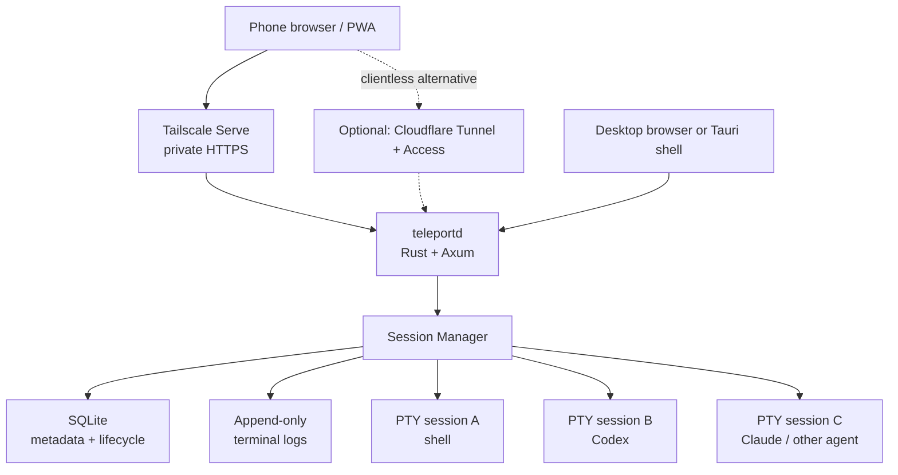

# 01 — Architecture

## The one decision that matters

This is **not** a desktop terminal application with remote access bolted on. It is a
headless session daemon with multiple thin clients. Language and desktop framework are
secondary consequences of that choice.



`teleportd` binds `127.0.0.1` only and serves **both** the compiled SPA and
`/api/v1/...` from the same HTTP origin. The secure remote path and the local desktop
path are therefore the same server, same API, same terminal protocol, same tests.

## What this eliminates

```text
No Tauri-specific RPC protocol
No separate mobile API
No native phone application in the MVP
```

The middle line is permanent: there is **one** API, and native apps will speak the same
one. The third is scope, not architecture — native iOS/Android shells are planned for v2
and the protocol is already shaped for them, because it streams raw VT bytes with byte
offsets and assumes nothing about browsers
([13-native-clients.md](13-native-clients.md#the-protocol-is-already-native-ready)).
Adding a mobile-specific endpoint would break that; adding a native client will not.

Tauri is a **shell and packaging concern**, not the application architecture. Its
entire job: open the UI, install/locate `teleportd`, poll `/health`, tray + menu,
notifications, updates. See [08-packaging.md](08-packaging.md).

**The Tauri process is not the conceptual owner of `teleportd`.** Bundling the daemon
as a sidecar is a distribution convenience. Session survival must not depend on a
WebView window staying alive. The packaged app starts `teleportd` as a normal
user-level background process and reconnects to an existing instance when the UI
reopens.

## Dependency direction

```text
UI
 ↓
HTTP / WebSocket protocol
 ↓
session service
 ↓
portable-pty
 ↓
Unix PTY / Windows ConPTY
```

Nothing above `session service` knows whether it is running on Windows. Platform
conditionals live in `pty.rs` and nowhere else. A `#[cfg(windows)]` in `api.rs` is a
bug.

## Repository layout

One repo holds the whole product: daemon, web app, desktop shell, native apps, and the
cloud infrastructure that arrives in v2. Directories that are empty in the MVP are listed
anyway, so nobody has to guess where a thing goes.

```text
teleport/
├── daemon/       teleportd — the only component that owns a PTY        [MVP]
├── web/          Svelte SPA, served by the daemon                      [MVP]
├── desktop/      thin Tauri shell                                      [MVP, last]
├── mobile/       native iOS + Android shells (WebView terminal)        [v2 — doc 13]
├── cloud/        identity, device directory, pairing, relay, push      [v2 — doc 14]
│   ├── api/
│   ├── relay/
│   └── infra/
├── shared/       protocol types kept in sync across clients            [v2]
└── docs/
```

**`cloud/` is not on the MVP critical path and must never become one.** Stages 1 and 2
of [12-identity-and-connectivity.md](12-identity-and-connectivity.md#the-three-stages)
run entirely on the user's own machine and network. If the daemon ever needs to phone
home to function, that is a bug.

## Module layout

Start with **one daemon crate**. Do not pre-split into a workspace.

```text
teleport/
├── daemon/
│   ├── Cargo.toml
│   └── src/
│       ├── main.rs          # CLI, config, startup sequence, graceful shutdown
│       ├── api.rs           # Axum router, HTTP handlers, WS upgrade
│       ├── ws.rs            # WebSocket attach loop, framing, control lease wiring
│       ├── session.rs       # SessionManager, Session, subscriber fan-out, lifecycle
│       ├── pty.rs           # portable-pty bridge, dedicated I/O threads, TerminalSession
│       ├── log.rs           # append-only output.vt writer + range reader
│       ├── persistence.rs   # SQLite writer actor, schema, migrations, recovery
│       ├── presets.rs       # agent presets loaded from presets.toml
│       ├── device.rs        # stable device_id/device_name (device.json)
│       └── auth.rs          # resolves every request to a Principal
│
├── web/
│   ├── src/
│   │   ├── App.svelte
│   │   ├── lib/api.ts       # HTTP client
│   │   ├── lib/stream.ts    # WebSocket client, offset tracking, reconnect
│   │   ├── lib/Terminal.svelte   # xterm.js, isolated
│   │   ├── lib/Sessions.svelte
│   │   └── lib/Session.svelte
│   └── vite.config.ts
│
├── desktop/
│   └── src-tauri/           # added last, thin
│
└── docs/
```

`auth.rs` exposes exactly one entry point — `resolve(req) -> Principal` — and handlers
take the `Principal`, never the headers. That single seam is what lets accounts and a
relay land later without touching handler code
([12-identity-and-connectivity.md](12-identity-and-connectivity.md#the-principal)).

## Sessions and agents are the same thing

An "agent" is **not** a new execution primitive. It is ordinary session metadata.

```text
Session
├── id
├── PTY
├── child process
├── cwd
├── argv
├── terminal size
├── output log
├── status
└── metadata
    ├── kind = "agent"
    └── preset = "codex"
```

Claude, Codex, shells, build systems, REPLs and every future CLI stay on one execution
path. Agent-specific structured integrations layer *above* this later; they never enter
the PTY subsystem.

## Session manager shape

```text
HTTP / WebSocket tasks          (Tokio)
        │
        ▼
 SessionManager
        │
        ├── metadata/state
        │
        └── Session
             ├── PTY master
             ├── child handle
             ├── output-reader thread      (dedicated OS thread)
             ├── input/control thread      (dedicated OS thread)
             ├── append-only output file
             ├── bounded subscriber queues
             └── one interactive-control lease
```

**Tokio owns networking and coordination. OS threads own blocking PTY I/O.**
Do not put permanently-blocking PTY loops on `spawn_blocking` — that pool is for
bounded work that finishes. A never-returning loop consumes a blocking-pool slot
forever. Details and rationale in [03-pty-layer.md](03-pty-layer.md).

## Startup sequence

```text
start teleportd
    ↓
resolve data dir, load config + presets
    ↓
open SQLite (WAL), run migrations
    ↓
mark stale "running"/"closing" sessions as "lost" (reason=daemon_restart)
    ↓
reconcile each session's output_bytes against actual output.vt length
    ↓
bind 127.0.0.1:7337
    ↓
serve SPA + API
    ↓
accept session requests
```

## Session creation sequence

```text
POST /api/v1/sessions
    ↓
validate: executable resolvable, cwd exists + is dir, 1<=cols<=1000, 1<=rows<=1000
    ↓
allocate id (ULID), create data/sessions/<id>/
    ↓
open output.vt for append
    ↓
insert metadata row (state=running)
    ↓
openpty(size)
    ↓
spawn_command(argv)          ← failure here: row → state=exited, exit_code=null,
    ↓                           lost_reason="spawn_failed", return 4xx/5xx
start dedicated reader thread + control thread
    ↓
return {id, state, pid, output_offset: 0}
```

Order matters: the log file and metadata row exist **before** the child can produce a
single byte. There is never output without somewhere to put it.

## The crash boundary

State this honestly in the UI and in the docs. SQLite can remember that a process used
to exist; it cannot recreate an OS PTY handle. On Windows, pseudoconsole lifetime is
tied to `HPCON` and its streams, and explicit closure has process-tree effects.

| Event | Live session | Metadata | Logs |
|---|---|---|---|
| Browser tab closed | survives | survives | survives |
| Phone sleeps / changes network | survives | survives | survives |
| Desktop UI quits | survives | survives | survives |
| Tailscale restarts (`--bg`) | survives | survives | survives |
| `teleportd` crashes | **lost** | survives | survives |
| Host reboots | **lost** | survives | survives |

On restart, any session still marked `running` with no live PTY becomes:

```text
state       = "lost"
lost_reason = "daemon_restart"
```

Logs stay readable. This is predictable and debuggable, which is worth more than a
half-working resurrection.

### If daemon-crash survival ever becomes a requirement

Change only the bottom of the architecture — nothing above `session service` moves:

```text
teleportd
 ├── session-broker A ── PTY A ── agent A
 ├── session-broker B ── PTY B ── agent B
 └── session-broker C ── PTY C ── shell
```

One long-lived broker process per PTY, each listening on a private local Unix socket
(named pipe on Windows). `teleportd` may crash and rediscover surviving brokers.

Cost: broker discovery, broker authentication, stale socket cleanup, version
compatibility across daemon/broker, one more process layer per session. It still does
**not** survive an OS reboot.

**Do not pay that cost until the requirement exists.** It is explicitly out of MVP
scope ([11-mvp-plan.md](11-mvp-plan.md#out-of-scope)).
