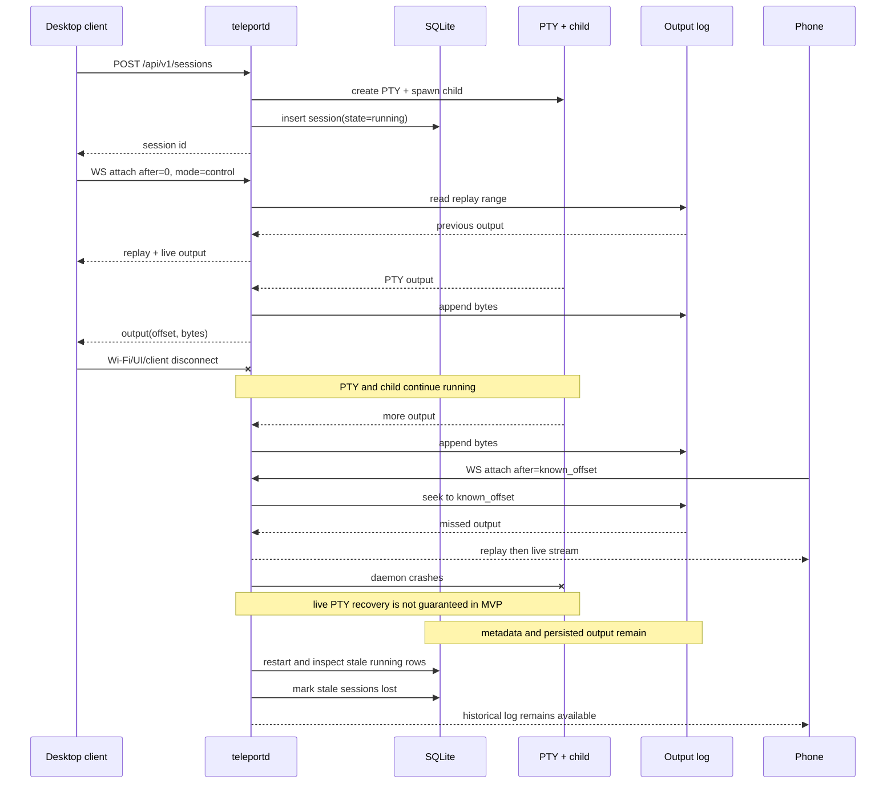

# 04 — API and wire protocol

**HTTP for resource lifecycle. One WebSocket per attached terminal session for live I/O.**

No gRPC, no protobuf, no WebRTC, no Socket.IO, no MCP transport, no Tauri command
protocol, no separate local IPC protocol. Axum provides routing and WebSocket upgrades;
that is the whole transport story for v1.

**Treat `/api/v1` as a public contract, not an internal one.** Web, desktop shell, and
future native apps all speak it, and native apps cannot be force-updated. Breaking
changes go to `/api/v2`; additive changes announce themselves through `capabilities` on
`/health`. Nothing in the protocol may assume the client is a browser
([13-native-clients.md](13-native-clients.md#the-protocol-is-already-native-ready)).

## HTTP surface

```text
GET    /api/v1/health

GET    /api/v1/sessions
POST   /api/v1/sessions
GET    /api/v1/sessions/{id}
DELETE /api/v1/sessions/{id}

GET    /api/v1/sessions/{id}/log
GET    /api/v1/sessions/{id}/stream   # WebSocket upgrade

GET    /api/v1/presets
```

Everything else is the SPA, served from the same origin at `/`.

**There is no `/agents` execution path.** An agent launch is a session creation
request. Adding `/agents` would create a second execution path and violate the
one-execution-path rule in [01-architecture.md](01-architecture.md#sessions-and-agents-are-the-same-thing).

### `GET /api/v1/health`

Two response shapes, by principal. **Unauthenticated** — the Tauri shell polls this to
decide whether to spawn a daemon, so it must answer before any credential exists:

```json
{
  "status": "ok",
  "version": "0.1.0",
  "api_versions": ["v1"],
  "capabilities": ["sessions", "presets", "tail_attach"]
}
```

**Authenticated** (any `Principal`) adds device and load information:

```json
{
  "status": "ok",
  "version": "0.1.0",
  "api_versions": ["v1"],
  "capabilities": ["sessions", "presets", "tail_attach"],
  "device_id": "01K4N4ZP6C5GJ17G6X47K0VJX3",
  "device_name": "aleh-macbook",
  "platform": "macos-aarch64",
  "pid": 41003,
  "uptime_ms": 913402,
  "sessions_running": 3
}
```

The hostname is mildly identifying, so it sits behind the principal. Nothing else in the
unauthenticated shape is sensitive — **do not add fields that are**.

`api_versions` and `capabilities` exist for **version skew**, which is unavoidable once
native apps ship: an App Store build can be months behind a daemon the user updated this
morning, and neither side can be forced to match. Clients must feature-detect from
`capabilities` rather than infer from `version`. Add a capability string whenever a new
optional behavior lands; never repurpose an existing one.

`device_id` / `device_name` come from `<data_dir>/device.json`, generated on first run
([12-identity-and-connectivity.md](12-identity-and-connectivity.md#device-identity)).
In the MVP nothing consumes them; they exist so that multi-device clients do not reshape
every payload later.

### `POST /api/v1/sessions`

```json
{
  "kind": "agent",
  "preset": "codex",
  "command": "codex",
  "args": [],
  "cwd": "/home/me/src/project",
  "cols": 120,
  "rows": 36,
  "env": { "RUST_LOG": "debug" }
}
```

| Field | Required | Rules |
|---|---|---|
| `kind` | yes | `"shell"` \| `"agent"` \| `"command"` |
| `preset` | no | preset id; when present, supplies defaults for `command`/`args`/`env` that explicit fields override |
| `command` | yes unless a preset supplies it | resolved via `PATH`; must resolve to an existing executable |
| `args` | no | **array of strings**, never a shell string |
| `cwd` | yes | must exist and be a directory |
| `cols`, `rows` | yes | `1..=1000` |
| `env` | no | explicit overrides only; **never persisted verbatim**, redacted in responses |

Response `201`:

```json
{
  "id": "01K4N4ZP6C5GJ17G6X47K0VJX3",
  "state": "running",
  "pid": 42117,
  "output_offset": 0
}
```

Errors: `400` malformed body, `422` executable not found on `PATH` / `cwd` is not a
directory, `500` spawn failure. **Not `404`** — the collection exists; the request is
unprocessable. Reserve `404` for an unknown session id.
Spawn failure still records a row (`state=exited`, `lost_reason="spawn_failed"`) so the
UI can show why.

### `GET /api/v1/sessions`

```json
{
  "sessions": [
    {
      "id": "01K4N4ZP6C5GJ17G6X47K0VJX3",
      "kind": "agent",
      "preset": "codex",
      "command": "codex",
      "args": [],
      "cwd": "/home/me/src/project",
      "state": "running",
      "pid": 42117,
      "cols": 120,
      "rows": 36,
      "output_bytes": 184221,
      "created_at_ms": 1756982400000,
      "started_at_ms": 1756982400112,
      "exited_at_ms": null,
      "exit_code": null,
      "lost_reason": null,
      "controller": "aleh's laptop",
      "subscribers": 2
    }
  ]
}
```

Sort newest-first. `env` never appears.

### `DELETE /api/v1/sessions/{id}`

Runs the termination state machine from
[03-pty-layer.md](03-pty-layer.md#termination). Returns `202` immediately with the
session in `closing`; clients watch the WebSocket `exit` frame or poll `GET`.

`?purge=true` additionally deletes `data/sessions/{id}/` after the session reaches
`exited`, **and then the `sessions` row** — directory first, row second, the same
ordering the collector uses ([05](05-persistence.md#garbage-collection)). Without it the
log is retained and the session stays in the list as `exited`.

Purge is also the only way a session leaves the list. On a session that has already
exited, `DELETE …?purge=true` skips the termination machine and deletes outright. A
purged id returns `404` from `GET` and `session_gone` to any client still attached.
Without this the list grows without bound and the UI has no delete affordance.

### `GET /api/v1/sessions/{id}/log`

Raw bytes, `Content-Type: application/octet-stream`. Supports `?from=&to=` byte offsets
and HTTP `Range`. Authorization is **identical to live attach** — terminal output
contains source code, paths, command output, and tokens accidentally printed by
commands. See [06-security.md](06-security.md).

### `GET /api/v1/presets`

```json
{
  "presets": [
    { "id": "codex", "label": "Codex", "command": "codex", "args": [], "icon": "codex" },
    { "id": "claude", "label": "Claude Code", "command": "claude", "args": [], "icon": "claude" },
    { "id": "shell", "label": "Shell", "command": "$SHELL", "args": ["-l"], "icon": "terminal" }
  ]
}
```

Loaded from `presets.toml` in the data dir. A preset supplies executable, argv defaults
and presentation metadata. **No scheduler, agent protocol, MCP layer or provider SDK is
needed to spawn the first Claude/Codex CLI.**

## WebSocket protocol

```text
GET /api/v1/sessions/{id}/stream?after=<u64>|tail=<bytes>&mode=control|observe
```

| Param | Default | Meaning |
|---|---|---|
| `after` | — | byte offset the client has already consumed; replay starts here |
| `tail` | `1048576` | replay only the last N bytes; used when the client has no cursor |
| `mode` | `observe` | `control` requests the lease **without preempting** — see [Control lease](#control-lease) |
| `client_id` | — | stable opaque id for this client install; required |
| `client_name` | `client_id` prefix | human label shown in the UI (`"aleh's phone"`) |

`after` and `tail` are mutually exclusive. Supplying neither means `tail=1 MiB`.

### Client identity

`client_id` is generated **by the client** on first run and persisted (localStorage in
the browser, keychain/preferences on native) — a ULID or UUID, opaque to the daemon. It
is not a credential and grants nothing; authentication is separate
([06-security.md](06-security.md#authentication)).

It exists because two things need it and neither works without it: naming the current
controller in the UI (`"Control taken by aleh's phone"`), and letting a controller that
dropped off Wi-Fi resume its own lease instead of racing for it. A client that omits it
gets a per-connection ephemeral id and loses lease resumption.
See [Bounded attach](#bounded-attach) — an unbounded default here is a bug, not a
convenience.

### Framing

```text
Text WebSocket frames     = control messages (JSON)
Binary client → server    = raw PTY input bytes
Binary server → client    = [8-byte big-endian u64 output offset][raw PTY output]
```

Terminal bytes are **never** JSON-encoded. The 8-byte prefix is the offset of the
*first* byte of the payload.

Client→server binary frames carry no header — they are raw input, forwarded verbatim to
the PTY writer.

### Control messages

Client → server:

```json
{"type":"resize","cols":120,"rows":36}
```
```json
{"type":"claim_control"}
```
```json
{"type":"release_control"}
```

Server → client:

```json
{
  "type":"ready",
  "session_id":"01K4N4ZP6C5GJ17G6X47K0VJX3",
  "replay_from":183296,
  "next_offset":184221,
  "truncated":false,
  "log_capped_at":null,
  "cols":120,
  "rows":36,
  "control":true,
  "controller":"aleh's phone"
}
```
```json
{"type":"control_granted"}
```
```json
{"type":"control_revoked","to":"aleh's phone","client_id":"01K5Q…"}
```
```json
{"type":"resized","cols":120,"rows":36}
```
```json
{"type":"exit","code":0,"final_offset":201908}
```
```json
{"type":"error","code":"not_controller","message":"input rejected: observer mode"}
```

`ready` is always the first frame after upgrade. `next_offset` tells the client where
the live stream begins, so it can detect that replay is complete. `replay_from` is where
replay actually started and `truncated` says whether the daemon clamped it — see
[Bounded attach](#bounded-attach). `log_capped_at` is non-null only for a log that hit
its size cap ([05-persistence.md](05-persistence.md#size-cap)).

**`cols` and `rows` are the PTY's current size, and every client needs them — observers
most of all.** There is exactly one PTY geometry per session and only the controller
sets it, so an observer that sizes its emulator to its own viewport renders output
wrapped for a different width. Observers letterbox to the PTY size instead
([09-frontend.md](09-frontend.md#geometry)). The same values arrive in `resized`
whenever the controller changes them.

## Offsets are the replay index

Using byte offsets instead of a separately persisted sequence table means **the
append-only output file itself is the index**. No database row per PTY chunk, and
duplicate detection is trivial.

A client that has consumed byte `184221` reconnects with:

```text
GET /api/v1/sessions/{id}/stream?after=184221&mode=control
```

The daemon seeks directly to that byte offset, replays what was missed, and switches
the connection to live output.

Client rule: track `next_offset` locally, advance it by payload length on every binary
frame, and send it as `after` on reconnect. Never assume the stream restarts at 0.

**A gap in the offsets is meaningful.** Offsets never rewind and two frames never
overlap, but a frame's offset *may* exceed the end of the one before it. That means the
daemon deliberately dropped bytes it could not serve: the log hit its size cap
([05-persistence.md](05-persistence.md#size-cap)), or replay was clamped mid-catch-up
([Attach race](#catch-up--register-late-not-early)). Clients render a discontinuity
exactly as they render `truncated: true` — a "scrollback truncated" marker — and never
splice the two sides together as though they were contiguous.

## Bounded attach

A long-running agent produces a large log. `after=0` on a 500 MB session would replay
500 MB — slow on a desktop, ruinous on cellular, and a trivial way for one reconnect to
saturate the daemon. **Replay is always bounded.**

```text
tail=N          → replay starts at max(0, next_offset - N)
after=N         → replay starts at N, clamped forward by max_replay_bytes
neither given   → tail = 1 MiB
```

`max_replay_bytes` (config, default 8 MiB) caps every replay regardless of parameters.
When a replay is clamped, `ready` says so:

```json
{
  "type":"ready",
  "session_id":"01K4N4ZP6C5GJ17G6X47K0VJX3",
  "replay_from":198320,
  "next_offset":201908,
  "truncated":true,
  "control":true
}
```

Clients render `truncated: true` as a "scrollback truncated" marker and offer
`GET /log` for the full history. Never silently pretend the stream started there.

### The VT-state caveat — read this before implementing

Replay that starts anywhere other than byte 0 drops the client into the **middle of a VT
stream**. Two things are then unknown:

1. The first bytes may be the tail of a split escape sequence, which renders as garbage.
2. Terminal *state* — colors, cursor mode, alt-screen, scroll region — was established
   by escape sequences that were never replayed.

**Interim mitigation (MVP):** the client resets the emulator (`term.reset()`) before
writing the first tailed chunk. That fixes state and leaves at most one corrupted line.
Acceptable, and honest.

**Proper fix (post-MVP):** the daemon maintains a VT parser per session and serves a
*state snapshot* — screen contents plus attributes — as the replay prefix. That is the
"terminal-state snapshots" item currently listed out of scope
([11-mvp-plan.md](11-mvp-plan.md#out-of-scope)), and native mobile clients are what will
pull it in. It is the single most likely v2 addition; do not design anything that
forecloses it. Specifically: keep replay a server-side decision, so a snapshot can later
be substituted for a byte range without a protocol change.

## Attach race

The race between "read the old log" and "subscribe to new output" must be handled
deliberately. Bytes produced between reading the file and registering the subscriber
would otherwise vanish.

**Correct order:**

```text
capture the output offset N                            ← mutex
             ↓
replay [requested_offset, N) in bounded rounds,
re-checking the gap each round (see Catch-up below)
             ↓
register subscriber, same mutex as the final,
freshly re-read N                                       ← mutex
             ↓
deliver buffered events >= N
             ↓
live stream
```

Registration and the read of `N` happen under **one** mutex — the same mutex the reader
loop takes when it advances `next_offset` and fans out
([03-pty-layer.md](03-pty-layer.md#reader-loop)). This guarantees every queued chunk
starts at or after `N`, so replay and live output meet exactly once with no gap and no
overlap.

### Catch-up — register late, not early

That ordering says *when* to register relative to reading `N`. It does not license
registering before the replay has been **written to the client**, and doing so is a
livelock.

A subscriber registered up front accumulates live output for the entire duration of its
replay, against the same 8 MiB queue bound
([03-pty-layer.md](03-pty-layer.md#backpressure)) that `max_replay_bytes` is also 8 MiB
of. On a session emitting 1 MB/s — the [load-sanity](10-testing.md#load-sanity) target —
an 8 MiB replay to a phone on cellular takes tens of seconds and buffers far more than
the bound. The subscriber overflows and is disconnected as a slow consumer *before it
ever goes live*; it reconnects further behind and fails again. That triggers on
precisely the session a user most wants to attach to, and no test that attaches to an
idle session will ever see it.

**The boundary therefore moves.** History is served in bounded rounds *before*
registering, and the subscriber is registered only once the gap it still owes fits in
its queue with room to spare:

```text
cursor = requested_offset
loop {
    lock:   N = next_offset;  end = min(N, readable_end);  gap = end - cursor
            if gap <= live_gap_bytes {          # 1 MiB — one eighth of the queue bound
                register subscriber             # same lock, same instant as reading N
                unlock
                write [cursor, end) to the client
                go live                         # every queued chunk starts at or after N
            }
    unlock
    write [cursor, cursor + replay_round_bytes) to the client    # off the lock
    cursor += replay_round_bytes
}
```

Each round is one short mutex acquisition and one bounded file read. **There is still
exactly one buffer in the design** — the subscriber queue — and it is still 8 MiB. What
changed is that it is no longer asked to hold history and live output at the same time.

Bounding each round at `replay_round_bytes` also gives the client its first painted
screen after 1 MiB rather than after the whole replay
([15-open-questions.md](15-open-questions.md#n3--xtermjs-write-pacing-on-reattach)).

**Convergence.** The gap closes only while the client outruns the producer — which is
the same condition it must meet to stay attached at all, so the loop demands nothing new
of it. A client that cannot is detected by the gap failing to shrink across four
consecutive rounds — but a client that always shrinks the gap, just barely, resets that
counter every round and would otherwise never stop re-acquiring the mutex. A second,
absolute floor catches that case too: past a fixed number of total rounds (four backlogs'
worth of the largest on-disk log), the daemon gives up regardless of whether the gap was
still inching down. Either floor clamps replay to the last `live_gap_bytes` before the
boundary, registers, and lets ordinary backpressure take it from there: the client gets
the live screen and a hole it is told about, instead of an unbounded reconnect loop.

**`ready` is still the first frame, and its `next_offset` is still the boundary captured
when the client attached** — not the one the subscriber is eventually registered at. The
client does not need the difference. History and live output are one contiguous byte
stream under one set of offsets, so "I have consumed up to `ready.next_offset`" still
means "I hold the session's full history as of the moment I attached", whichever side of
the handover each byte arrived from.

If `after > N`, the client is ahead of the daemon (log was purged, or a stale client
after a `lost` session): reply `error` with code `offset_ahead` and `next_offset`, and
let the client restart from `0`.

## Control lease

- Exactly one controller per session, or none.
- **`claim_control` preempts. `mode=control` on attach does not.** That distinction is
  the whole design; see below.
- Input or resize from a non-controller is dropped with an `error` frame. It is never
  buffered and never applied later.

### Why attach must not preempt

`claim_control` is an explicit human action — a tap on "Take control" — and it wins
immediately. The previous controller receives `control_revoked` and silently becomes an
observer. No negotiation, no confirmation dialog: grabbing a runaway agent from a phone
has to be one tap.

Attaching is **not** a human action. Clients reconnect on their own, constantly, after
every sleep and tunnel drop. If `mode=control` preempted, this would happen:

```text
desktop holds control → laptop sleeps → socket dies
phone taps "Take control"              → phone is controller
laptop wakes, reconnects mode=control  → silently steals it back, mid-keystroke
```

On a flaky link that ping-pongs indefinitely, and it is exactly the multi-device
scenario the product exists for. So `mode=control` means *"give me the lease if it is
mine to take"*, and grants only when:

```text
the lease is free and unheld by a grace holder, or
the grace holder is this client_id
```

Otherwise the attach succeeds as an observer with `control:false`, and the user can tap
to preempt deliberately.

### Disconnect grace

When a controller's socket drops, the lease is **not** released immediately. It is held
for `control_grace_ms` (config, default 15000) against that `client_id`, so an ordinary
reconnect resumes control rather than racing for it.

During the grace window the lease is still preemptible — `claim_control` from any other
client takes it instantly, and the grace holder loses its claim permanently. Grace only
protects against nobody else wanting it. When the window expires with no reconnect, the
lease goes free; it is **never** auto-granted to a waiting observer.

## Full lifecycle



## Keepalive and reconnection

Long-lived WebSockets get terminated by network software in the middle. Cloudflare
documents proxied WebSocket support but explicitly notes that deployments can drop
connections and recommends heartbeats. Design for it rather than treating a drop as an
error.

- Server sends a WebSocket `Ping` every **20 s**.
- Server closes a connection with no `Pong` within **60 s**.
- Client reconnects with exponential backoff (250 ms → 8 s, jittered), always passing
  its tracked `after` offset.
- A reconnect is a **normal event**, not an error state. The UI shows a subtle
  "reconnecting" indicator, never a modal, and never clears the terminal buffer.

## Error codes

| `code` | Meaning | Client action |
|---|---|---|
| `not_controller` | input/resize from an observer | show "Take control" affordance |
| `offset_ahead` | `after` exceeds daemon's `next_offset` | restart from `0` |
| `session_gone` | id unknown or purged | return to session list |
| `session_closing` | input during termination | disable input |
| `slow_consumer` | queue overflow (WS close 1013) | reconnect with backoff from last offset |
| `bad_origin` | Origin/Host rejected | hard failure, do not retry |
| `unauthorized` | missing or invalid credential | prompt for the token / re-pair |
